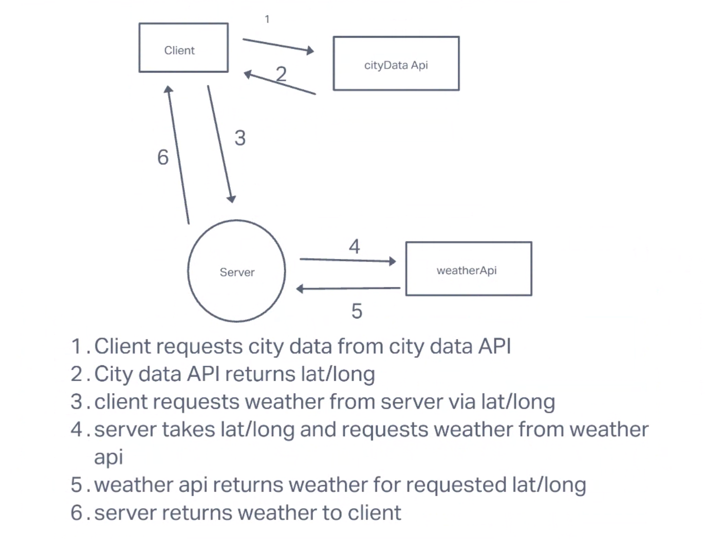

# city-explorer-api

**Author**: Dylan Ullrich
**Version**: 1.0.0 (increment the patch/fix version number if you make more commits past your first submission)

## Overview

### Getting Started

## Architecture

### Web Request Response Cycle

#### Iteration 1

#### Iteration 2

#### Iteration 3

#### Iteration 4

### Change Log

### Credit and Collaborations

## Timeline

### 1) Setup

Estimate of time needed to complete: 45 mins
Start time: 5:40
Finish time: 6:00
Actual time needed to complete: 20 mins

### 2) Weather

Estimate of time needed to complete: 2
Start time: 10:00
Finish time: 2:00
Actual time needed to complete: 3 hours

### 3) Errors

Estimate of time needed to complete: 45 mins
Start time: 3:00
Finish time: 4:05
Actual time needed to complete: 1 hour 55 mins

### 4) Weather 2.0

Estimate of time needed to complete: 1 hour
Start time: 7:06
Finish time: 7:47
Actual time needed to complete: 41 mins

### 5) Movies 2.0

Estimate of time needed to complete: 1 hours
Start time: 8:00
Finish time: 9:00
Actual time needed to complete: 1 hour

### 5) Cache

Estimate of time needed to complete: 1 hours
Start time: 930
Finish time: 1145
Actual time needed to complete: 2 hours 15 mins
